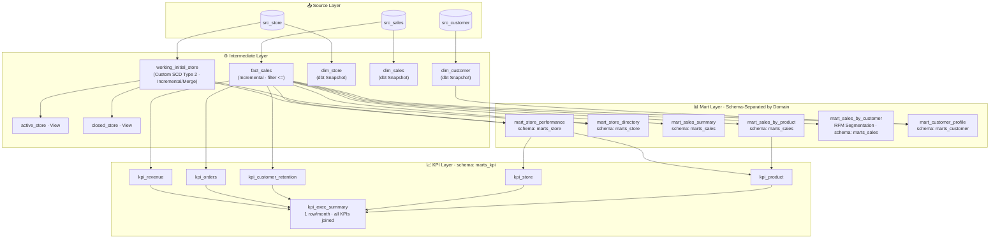

# Retail Analytics Platform

> End-to-end data pipeline for multi-store retail intelligence — built with dbt, PostgreSQL, and GitHub Actions CI/CD.

[](https://github.com/hansenlaw/dbt_project/actions/workflows/dbt-ci.yml)
[](https://github.com/hansenlaw/dbt_project/actions/workflows/dbt-nightly.yml)


---

## Table of Contents

- [Overview](#overview)
- [Architecture](#architecture)
- [Key Features](#key-features)
- [Project Structure](#project-structure)
- [Getting Started](#getting-started)
- [Running the Pipeline](#running-the-pipeline)
- [Data Quality & Testing](#data-quality--testing)
- [CI/CD & Monitoring](#cicd--monitoring)
- [Mart Catalog](#mart-catalog)

---

## Overview

This started with a real data problem: the retail source system assigns new store codes whenever a branch gets rebranded — `Y010` becomes `Y011` becomes `Y012` — while the physical location never moves. Standard SCD2 breaks here because there's no stable natural key coming from the source. Tracking cumulative store revenue across a rebrand became impossible with naive approaches.

The fix: use latitude and longitude as the immutable identity anchor. Every downstream table that references store identity flows through this geographic surrogate key, so historical aggregations hold regardless of how many times the code has changed.

That core challenge shaped the entire pipeline design. Three layers — **Source → Intermediate → Mart** — with explicit materialization choices at each stage, a two-tier data quality framework, and full CI/CD coverage. On top of that sits a KPI layer feeding a 43-card Metabase executive dashboard.

| Layer | What it solves |
|---|---|
| Custom SCD Type 2 (intermediate) | Store code changes tracked via lat/lon — historical revenue aggregates correctly across rebrands |
| Mart layer with snapshots | Unified customer 360°: purchase history, RFM segment, tier progression all in one table |
| CI/CD + nightly schedule | Pipeline failures caught before dashboards break — Telegram alerts on every run |
| KPI layer → Metabase | C-level metrics in one place: 6 domain models FULL JOINed into a single monthly summary |

---

## Architecture



---

## Key Features

### Custom SCD Type 2 — Store Identity Resolution

Standard SCD2 requires a stable natural key. The source system provides none — store codes change on rebranding (e.g. `Y010 → Y011 → Y012`). This pipeline derives a stable surrogate key from **latitude and longitude**, enabling accurate historical aggregation across all code changes.

```sql
-- Derive a stable store identity from immutable geographic coordinates
initial_store AS (
    SELECT store_code AS initial_store_code, latitude, longitude
    FROM src_store
    WHERE ROW_NUMBER() OVER (
        PARTITION BY latitude, longitude ORDER BY partition_time
    ) = 1
)
-- Y010, Y011, and Y012 are now unified under one persistent identity
```

The model uses dbt's `incremental` + `merge` strategy to close previous records and insert new versions on each batch run — without relying on source-provided timestamps.

| initial_store_code | store_code | start_date | end_date   |
|--------------------|------------|------------|------------|
| Y010               | Y010       | 2026-01-01 | 2026-02-01 |
| Y010               | Y011       | 2026-02-01 | 2026-03-01 |
| Y010               | Y012       | 2026-03-01 | 9999-12-31 |

---

### RFM Customer Segmentation

Every customer is scored across three behavioral dimensions and classified into one of five segments using a four-stage CTE pipeline — ready for direct consumption by the marketing team with no additional transformation required.

```
Recency   →  Days since last purchase    Score 1–3
Frequency →  Total distinct orders       Score 1–3
Monetary  →  Cumulative spend            Score 1–3

Score ≥ 8               →  Champions
Score ≥ 6               →  Loyal
High Recency, Low Freq  →  Promising
Low Recency, High Freq  →  At Risk
Otherwise               →  Need Attention
```

---

### Store Performance Analytics with Window Functions

```sql
-- Monthly revenue ranking across all branches
RANK() OVER (PARTITION BY month ORDER BY total_revenue DESC) AS revenue_rank,

-- Running cumulative revenue per store
SUM(total_revenue) OVER (
    PARTITION BY initial_store_code
    ORDER BY month
    ROWS BETWEEN UNBOUNDED PRECEDING AND CURRENT ROW
) AS cumulative_revenue
```

---

### Customer Tier Journey Reconstruction

Combines dbt Snapshot (automated SCD2 for the customer dimension) with `STRING_AGG` to reconstruct each customer's complete loyalty tier progression, ordered chronologically.

```sql
STRING_AGG(tier, ' → ' ORDER BY dbt_valid_from) AS tier_journey
-- Example: "Bronze → Silver → Gold"
```

---

## Project Structure

```
.
├── .github/workflows/
│   ├── dbt-ci.yml              # CI on push to main & pull requests
│   └── dbt-nightly.yml         # Scheduled daily at 00:00 UTC + manual dispatch
│
├── models/
│   ├── sources.yml
│   ├── intermediate/
│   │   ├── working_initial_store.sql   # Custom SCD Type 2 (incremental/merge)
│   │   ├── fact_sales.sql              # Incremental fact table (append, filter <=)
│   │   ├── active_store.sql            # View — active stores only
│   │   ├── closed_store.sql            # View — closed stores only
│   │   └── schema.yml
│   ├── marts/
│   │   ├── store/
│   │   │   ├── mart_store_performance.sql
│   │   │   └── mart_store_directory.sql
│   │   ├── sales/
│   │   │   ├── mart_sales_summary.sql
│   │   │   ├── mart_sales_by_product.sql
│   │   │   └── mart_sales_by_customer.sql   # RFM segmentation
│   │   ├── customer/
│   │   │   └── mart_customer_profile.sql
│   │   └── schema.yml
│   └── kpi/
│       ├── kpi_revenue.sql              # Monthly revenue KPIs
│       ├── kpi_orders.sql               # Monthly order & basket KPIs
│       ├── kpi_customer_retention.sql   # Retention, churn, new vs returning
│       ├── kpi_store.sql                # Store network performance
│       ├── kpi_product.sql              # Product portfolio KPIs
│       ├── kpi_exec_summary.sql         # Wide table — all KPIs joined (1 row/month)
│       └── schema.yml
│
├── snapshots/
│   ├── dim_store.sql       # Store attributes — SCD2 via dbt snapshot
│   ├── dim_sales.sql       # Transaction corrections tracking
│   └── dim_customer.sql    # Customer tier change tracking
│
├── tests/
│   ├── assert_store_date_range_valid.sql
│   ├── assert_no_duplicate_active_store.sql
│   ├── assert_sales_store_exists.sql
│   ├── assert_rfm_segment_coverage.sql
│   └── assert_no_duplicate_active_customer.sql
│
├── macros/
│   ├── clean_id.sql / clean_name.sql / clean_email.sql
│   ├── filter_store_by_status.sql
│   └── tests/                   # 6 custom generic test macros
│
├── script/
│   ├── setup.sql                # ONE-SHOT: drop & recreate ALL source tables
│   │                            #   src_sales    — 9 monthly batches (Jan–Sep 2026, 172 orders)
│   │                            #   src_store    — 9 monthly batches (Y001–Y100, SCD code changes)
│   │                            #   src_customer — 9 monthly batches (CUST001–CUST064, tier progressions)
│   └── check_table.sql          # Diagnostic queries for each pipeline layer
│
└── dbt_project.yml              # raw_data_date default: 2026-09-01
```

---

## Getting Started

### Prerequisites

- Python 3.10+
- PostgreSQL 15
- Git

### 1. Clone the Repository

```bash
git clone https://github.com/hansenlaw/dbt_project.git
cd dbt_project
```

### 2. Install dbt

```bash
pip install dbt-postgres
```

### 3. Configure Database Connection

Create `~/.dbt/profiles.yml`:

```yaml
io_testing:
  outputs:
    dev:
      type: postgres
      host: localhost
      port: 5432
      dbname: demo_io
      user: postgres
      password: your_password
      schema: public
      threads: 4
  target: dev
```

### 4. Create the Database and Load Source Data

Run `script/setup.sql` — it creates and populates **all three** source tables in one shot:

```bash
# Create the database first in PostgreSQL, then run:
psql -U postgres -d demo_io -f script/setup.sql
```

> **What `setup.sql` does:**
> 1. `DROP TABLE … CASCADE` + `CREATE TABLE` for `src_sales`, `src_store`, `src_customer`
> 2. Inserts 9 monthly batches for each table (Jan–Sep 2026)
> 3. Prints verification queries at the end so you can confirm row counts
>
> Running this file resets all source tables to a clean, known state.

### 5. Install dbt Packages and Validate

```bash
dbt deps
dbt debug
```

---

## Running the Pipeline

### Option A — Full Refresh (Recommended for First Run)

Builds everything from scratch. The `raw_data_date` variable controls how far back to load —
set to `2026-09-01` by default, which loads all nine months (Jan–Sep) in one command.

```bash
# Build all intermediate + mart + kpi models from scratch
dbt run --full-refresh

# Run dimension snapshots (once per batch, in order)
dbt snapshot --vars '{raw_data_date: 2026-01-01}'   # loads Jan states
dbt snapshot --vars '{raw_data_date: 2026-02-01}'   # detects tier/store changes in Feb
dbt snapshot --vars '{raw_data_date: 2026-03-01}'   # Mar
dbt snapshot --vars '{raw_data_date: 2026-04-01}'   # Apr
dbt snapshot --vars '{raw_data_date: 2026-05-01}'   # May
dbt snapshot --vars '{raw_data_date: 2026-06-01}'   # Jun
dbt snapshot --vars '{raw_data_date: 2026-07-01}'   # Jul
dbt snapshot --vars '{raw_data_date: 2026-08-01}'   # Aug
dbt snapshot --vars '{raw_data_date: 2026-09-01}'   # Sep

# Run all tests
dbt test
```

`raw_data_date` defaults to `2026-09-01` in `dbt_project.yml`, so `dbt run --full-refresh`
without `--vars` loads all nine months of data.

### Option B — Incremental Batch Loading

Process one new month at a time. Incremental models detect and append only new records.

```bash
# For each new monthly batch, run in this order:
dbt run --select working_initial_store --vars '{raw_data_date: 2026-02-01}'
dbt run --select fact_sales            --vars '{raw_data_date: 2026-02-01}'
dbt snapshot                           --vars '{raw_data_date: 2026-02-01}'
dbt run --select marts.* kpi.*
dbt test
```

### Expected Output After Full Refresh

| Model | Rows | Key Metrics |
|---|---|---|
| `fact_sales` | 172 | Jan(18)+Feb(16)+Mar(18)+Apr(20)+May(19)+Jun(24)+Jul(26)+Aug(24)+Sep(27) |
| `kpi_exec_summary` | 9 | One row per month: 2026-01 through 2026-09 |
| `kpi_customer_retention` | 9 | Retention: Jan=NULL, Feb=50%, Mar=57%, Apr=59%, May=58%, Jun=67%, Jul=67%, Aug=64%, Sep=67% |
| `mart_store_performance` | 45 | 5 stores × 9 months |

---

## Data Quality & Testing

Data quality is enforced through a two-layer testing framework that runs on every CI pipeline execution.

### Layer 1 — Generic Tests

Column-level constraints declared in `schema.yml` and applied across all models:

| Test | Applied To |
|---|---|
| `not_null` | All primary and foreign keys |
| `unique` | All identifier columns |
| `accepted_values` | Tier values, store status, RFM scores |
| `assert_positive_amount` | All monetary columns |
| `assert_positive_quantity` | All quantity columns |
| `assert_total_amount_consistent` | `total_amount ≈ qty × unit_price` (with tolerance) |

### Layer 2 — Singular Tests

Business-rule assertions written as plain SQL in the `tests/` directory:

| Test | Rule Enforced |
|---|---|
| `assert_store_date_range_valid` | `end_date >= start_date` across all SCD2 records |
| `assert_no_duplicate_active_store` | At most one active record per store at any time |
| `assert_sales_store_exists` | Every sale resolves to a valid store via SCD2-aware join |
| `assert_rfm_segment_coverage` | Every customer has a valid, non-null RFM segment |
| `assert_no_duplicate_active_customer` | Each customer appears exactly once in the profile mart |

> A dbt test **passes** when its SQL query returns **zero rows**. Any returned row represents a record that violates the defined business rule.

```bash
dbt test                                          # run all tests
dbt test --select assert_store_date_range_valid   # run one specific test
```

---

## CI/CD & Monitoring

### Automated Workflows

#### On Every Push and Pull Request — `dbt-ci.yml`

Every code change is validated in a clean, ephemeral environment before it can reach `main`.

```
Developer pushes code or opens a PR
             │
             ▼
GitHub provisions a fresh Ubuntu server
  ┌──────────────────────────────────────┐
  │ 1. Checkout repository               │
  │ 2. Set up Python 3.12               │
  │ 3. pip install dbt-postgres          │
  │ 4. Generate profiles.yml at runtime  │ ← credentials never stored in repo
  │ 5. dbt compile                       │ ← syntax + dependency validation
  │ 6. Upload artifacts (logs + target)  │ ← retained for 90 days
  │ 7. Notify Telegram on failure        │
  └──────────────────────────────────────┘
             │
             ▼
Server destroyed — no state persists
```

#### Every Night at 00:00 UTC — `dbt-nightly.yml`

Runs fully autonomously as a daily health check. Catches upstream schema changes or silent data issues before they affect business dashboards. Also supports manual dispatch from the Actions tab.

### Telegram Alerting

Real-time pipeline status delivered to mobile. Implemented with pure Python standard library — no third-party Action dependencies.

```
dbt-ci.yml    →  Notifies on failure only       (avoids noise on frequent pushes)
dbt-nightly   →  Notifies on every run          (daily health confirmation)
```

### Where to Find Results

| Location | Contents |
|---|---|
| [Actions tab](https://github.com/hansenlaw/dbt_project/actions) | Full log history of every workflow run |
| Artifacts (per run, 90 days) | `logs/dbt.log` · `target/run_results.json` · compiled SQL |
| Commit status badge | ✓ / ✗ per commit, visible across the repository |
| Pull Request checks | Required to pass before merge |
| Telegram | Instant mobile notification with direct link to log |

---

## Model Catalog

### Mart Layer

| Table | Schema | Consumer | Key Metrics |
|---|---|---|---|
| `mart_store_performance` | `marts_store` | Store Operations | Monthly revenue, orders, unique customers, revenue rank, cumulative revenue |
| `mart_store_directory` | `marts_store` | Store Operations | Active/closed status, current code, code change history, lifetime revenue |
| `mart_sales_summary` | `marts_sales` | Sales Team | Daily & monthly aggregates, month-over-month revenue growth |
| `mart_sales_by_product` | `marts_sales` | Sales Team | Revenue & quantity per product, monthly rank, price range |
| `mart_sales_by_customer` | `marts_sales` | Sales Team | RFM scores, behavioral segment, favorite product, lifespan |
| `mart_customer_profile` | `marts_customer` | Marketing / CRM | Current tier, tier journey, lifetime value, days as customer |

### KPI Layer

| Table | Schema | Consumer | Key Metrics |
|---|---|---|---|
| `kpi_revenue` | `marts_kpi` | Finance | Total revenue, MoM growth, 3M rolling avg, cumulative revenue |
| `kpi_orders` | `marts_kpi` | Sales / Ops | Orders, AOV, basket size, store productivity, MoM trends |
| `kpi_customer_retention` | `marts_kpi` | CRM / Growth | New vs returning, retention rate, churn rate, buyer growth |
| `kpi_store` | `marts_kpi` | Operations | Top/bottom store code (pre-computed via `DISTINCT ON`), revenue gap, top-3 concentration %, network MoM |
| `kpi_product` | `marts_kpi` | Merchandising | Portfolio breadth, diversity index, top product by revenue & qty |
| `kpi_exec_summary` | `marts_kpi` | C-Level / CEO | **All 5 KPIs FULL JOINed — 1 row per month, 40+ columns — powers the Tab 1 Executive dashboard in Metabase** |

---

## Materialization Reference

| Model | Strategy | Rationale |
|---|---|---|
| `working_initial_store` | Incremental — merge | SCD2: close previous records, insert new versions. Full-refresh builds complete history from all batches via `LEAD()`. |
| `fact_sales` | Incremental — append | Filter `partition_time <=` loads all batches up to `raw_data_date`. Deduplication via `NOT EXISTS`. |
| `dim_*` | Snapshot | Automated SCD2 via dbt `check` strategy. Run once per batch in sequence. |
| `active_store`, `closed_store` | View | Lightweight filter on `working_initial_store`. No storage cost. |
| `mart_*` | Table | Business-ready; full rebuild on every run guarantees correctness. |
| `kpi_*` | Table | Rebuilt fully each run from mart layer. One row per calendar month. |

---

*All source data in this repository is fully synthetic, generated to replicate real-world retail patterns.*
